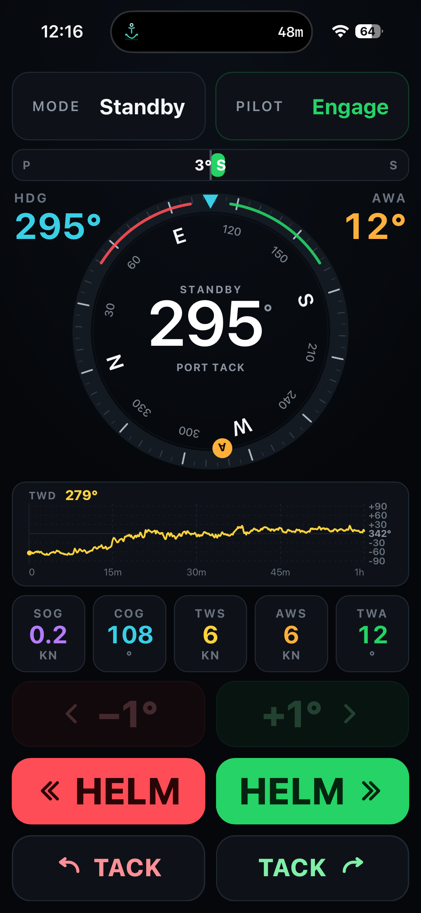

# AC42 Pilot — SignalK Plugin

Control a Simrad **AC42** autopilot (and likely other Simrad/B&G NAC-2 / NAC-3 / AC12 calculators)
directly over **NMEA 2000**, from a mobile-friendly web app.

Built for real sailing conditions: big buttons, wet fingers, glanceable at a distance.



## Features

- **Auto** (heading hold), **Wind** (apparent wind angle hold), **Standby**
- Course corrections **±1° / ±10°**
- **Tack**, with a long-press confirmation to avoid accidental triggers
- **NFU** (non-follow-up / direct helm) in Standby
- Animated wind rose
- 1-hour **TWD history** strip
- SOG / COG / TWS / AWS / TWA instrument tiles

## Compatibility

- **Confirmed**: Simrad AC42
- **Likely** (untested — feedback welcome): NAC-2, NAC-3, AC12, and other Simrad/B&G NMEA2000
  autopilot computers using the same "Simnet" command set
- Requires SignalK with NMEA2000 access over **SocketCAN** (`can0`), plus the `canboat` tools
  (`candump`, `candump2analyzer`, `analyzer`) and `can-utils` (`cansend`) installed on the host.
  This is standard on **OpenPlotter**.

If you run this on a different autopilot brand/model, PGN 130850 commands will simply be ignored —
it's harmless, but it won't do anything either. Please open an issue with your results either way.

## How it works

The AC42 only accepts NMEA2000 command frames (PGN 130850, "Simnet: AP Command") when they're sent
from the **CAN source address of a currently active B&G controller** (a physical MFD or autopilot
head that's emitting the PGN 65305 heartbeat). Commands sent from an arbitrary or fixed address are
silently ignored.

This plugin detects the currently active controller address on the bus and emits commands "on its
behalf" — the real controller head keeps working normally in parallel, nothing is spoofed or
disabled. This detection is fully automatic and adapts to your boat's setup (see Configuration below).

## Installation

**Via SignalK App Store** (recommended): in the SignalK admin UI, go to the *Appstore* tab and
search for `AC42 Pilot`.

**Via npm**:
```bash
cd ~/.signalk
npm install signalk-ac42-autopilot
```
Then restart SignalK.

## Configuration

All settings are optional — the plugin auto-detects everything needed on a standard setup.

| Option | Default | Description |
|---|---|---|
| `canInterface` | `can0` | SocketCAN interface name |
| `apAddress` | auto-detected | NMEA2000 source address of the autopilot computer. Override only if auto-detection picks the wrong device. |
| `windDirectionSource` | auto-detected | SignalK source for True Wind Direction shown in the app. Falls back to any available source if the preferred one is silent for >8s. |
| `fixedControllerAddress` | auto-detected | Force a specific active-controller address instead of dynamic detection. |
| `staleMs` | — | Timeout before considering a source "stale" for fallback purposes. |

## Security / Disclaimer

- This plugin sends real autopilot commands over your NMEA2000 bus. **Test at the dock before
  relying on it underway.**
- It does not replace proper watchkeeping. You remain responsible for the safe operation of your
  vessel at all times.
- If SignalK security is enabled, the API and web app require a logged-in session.
- Use at your own risk. See [LICENSE](LICENSE) for the full disclaimer of warranty.

## Known limitations

- **Nav mode** (route following) is not implemented.
- Compatibility beyond the AC42 is unconfirmed — feedback from other Simrad/B&G setups welcome.
- TWD history is client-side only (resets on page reload, no server-side persistence).
- Tack: heading target flips with the tack; expect a small rounding gap (±1°) vs. the physical pilot.

## Credits

Protocol reverse-engineered from scratch by capturing and decoding NMEA2000 traffic on a real boat.
Thanks to the [canboat](https://github.com/canboat/canboat) and [SignalK](https://signalk.org) projects
and communities.

## License

Apache-2.0 — see [LICENSE](LICENSE).
