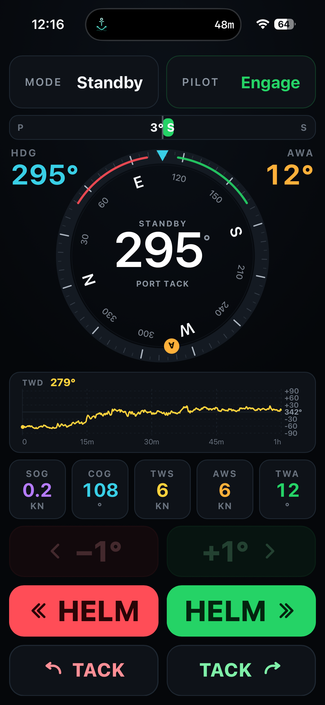

# AC42 Pilot — SignalK Plugin

Control a Simrad **AC42** autopilot (and likely other Simrad/B&G NAC-2 / NAC-3 / AC12 calculators)
directly over **NMEA 2000**, from a mobile-friendly web app.

Built for real sailing conditions: big buttons, wet fingers, glanceable at a distance.



## Features

- **Auto** (heading hold), **Wind** (apparent wind angle hold), **Standby**
- Course corrections **±1° / ±10°**
- **Tack**, with a long-press confirmation to avoid accidental triggers
- **NFU** (non-follow-up / direct helm) in Standby
- Animated wind rose
- 1-hour **TWD history** strip
- SOG / COG / TWS / AWS / TWA instrument tiles

## Compatibility

- **Confirmed**: Simrad AC42
- **Likely** (untested — feedback welcome): NAC-2, NAC-3, AC12, and other Simrad/B&G NMEA2000
  autopilot computers using the same "Simnet" command set
- Requires SignalK with NMEA2000 access over **SocketCAN** (`can0`), plus the `canboat` tools
  (`candump`, `candump2analyzer`, `analyzer`) and `can-utils` (`cansend`) installed on the host.
  This is standard on **OpenPlotter**.

If you run this on a different autopilot brand/model, PGN 130850 commands will simply be ignored —
it's harmless, but it won't do anything either. Please open an issue with your results either way.

## How it works

The AC42 only accepts NMEA2000 command frames (PGN 130850, "Simnet: AP Command") when they're sent
from the **CAN source address of a currently active B&G controller** (a physical MFD or autopilot
head that's emitting the PGN 65305 heartbeat). Commands sent from an arbitrary or fixed address are
silently ignored.

This plugin detects the currently active controller address on the bus and emits commands "on its
behalf" — the real controller head keeps working normally in parallel, nothing is spoofed or
disabled. This detection is fully automatic and adapts to your boat's setup (see Configuration below).

## Installation

**Via SignalK App Store** (recommended): in the SignalK admin UI, go to the *Appstore* tab and
search for `AC42 Pilot`.

**Via npm**:
```bash
cd ~/.signalk
npm install signalk-ac42-autopilot
```
Then restart SignalK.

## Configuration

All settings are optional — the plugin auto-detects everything needed on a standard setup.

| Option | Default | Description |
|---|---|---|
| `canInterface` | `can0` | SocketCAN interface name |
| `apAddress` | auto-detected | NMEA2000 source address of the autopilot computer. Override only if auto-detection picks the wrong device. |
| `windDirectionSource` | auto-detected | SignalK source for True Wind Direction shown in the app. Falls back to any available source if the preferred one is silent for >8s. |
| `fixedControllerAddress` | auto-detected | Force a specific active-controller address instead of dynamic detection. |
| `staleMs` | — | Timeout before considering a source "stale" for fallback purposes. |
| `usageStats` | `true` | The daily "this install exists" ping described below. Off means nothing counts your installation anywhere. |
| `usageEndpoint` | `https://autopolar.quicky.app/v1/ping` | Where that ping goes. Empty disables it just as surely as the switch above. |

## Letting me know this install exists

There is no honest way to find out whether anyone is running a SignalK plugin.
npm download counts are mostly mirrors and security scanners, and a boat that
installs once and then sails for three years without updating never appears
again. This plugin has no other channel — it publishes nothing, it phones
nothing home, and it has no shared pool the way a polar plugin does.

So, once a day, it says that it exists. It sends this and nothing else:

| field | why |
|---|---|
| a random ID | drawn once on this install, tied to nothing — not your boat, not your hardware, not your network. Without it the count would rest on IP addresses, which over CGNAT satellite links means nothing at all |
| plugin version | so I know which versions are actually out there before breaking anything |
| Node and SignalK versions | same reason |
| the date the ID was drawn | to tell a new install from an old one |

**Nothing of your boat, your pilot or your bus leaves the machine.** No
position, no heading, no rudder angle, no wind, no NMEA 2000 address, no
autopilot mode. No IP address is kept by the server either. The exact payload
is readable at any time at `/plugins/signalk-ac42-autopilot/usage.json`, and
linked from the web app itself as *What this app sends*.

Nothing goes out in the first hour of running: an install that gets tried for
five minutes and removed is not an install, and a `npm test` is not one either.
A failed ping is simply lost — there is no retry queue, deliberately. A
statistic has no business being handled more carefully than the things that
actually steer the boat.

Switch it off with **Let me know this install exists** in the plugin
configuration, or empty `usageEndpoint`. The plugin then works exactly as
before.

I would rather ask for this in plain sight and have some of you say no, than
hide it behind a "connectivity check" and have you find it in the source. It is
readable JavaScript on a server you own; you would find it.

The endpoint is shared with my other plugin for now, which is why the default
URL says `autopolar` — the counter separates them by plugin name. It will move
to its own name later.

## Security / Disclaimer

- This plugin sends real autopilot commands over your NMEA2000 bus. **Test at the dock before
  relying on it underway.**
- It does not replace proper watchkeeping. You remain responsible for the safe operation of your
  vessel at all times.
- If SignalK security is enabled, the API and web app require a logged-in session.
- Use at your own risk. See [LICENSE](LICENSE) for the full disclaimer of warranty.

## Known limitations

- **Nav mode** (route following) is not implemented.
- Compatibility beyond the AC42 is unconfirmed — feedback from other Simrad/B&G setups welcome.
- TWD history is client-side only (resets on page reload, no server-side persistence).
- Tack: heading target flips with the tack; expect a small rounding gap (±1°) vs. the physical pilot.

## Credits

Protocol reverse-engineered from scratch by capturing and decoding NMEA2000 traffic on a real boat.
Thanks to the [canboat](https://github.com/canboat/canboat) and [SignalK](https://signalk.org) projects
and communities.

## License

Apache-2.0 — see [LICENSE](LICENSE).
